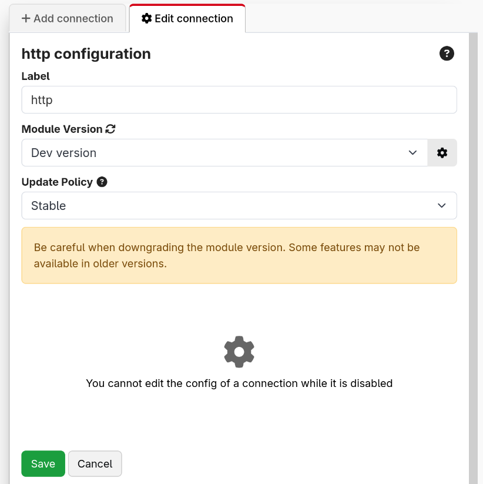
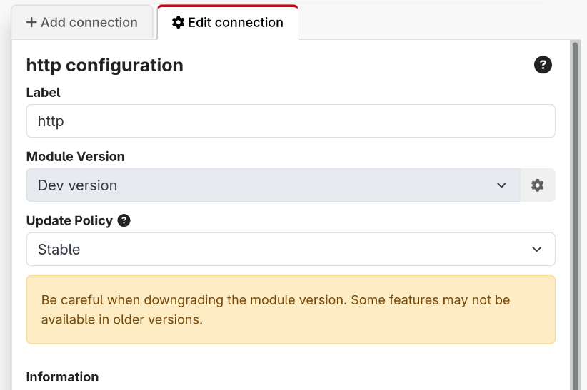

Once you have added a connection, you can click on it in the connection list to open its configuration in the right panel.

When the connection is disabled, you will be able to configure the version of the module, and some other basic properties.

In case you need it, you are able to force a connection to use a different module. This should not be needed for normal use, it is an escape hatch for edge cases we haven't thought of.

When the connection is enabled, you will be able to configure the module defined configuration.

