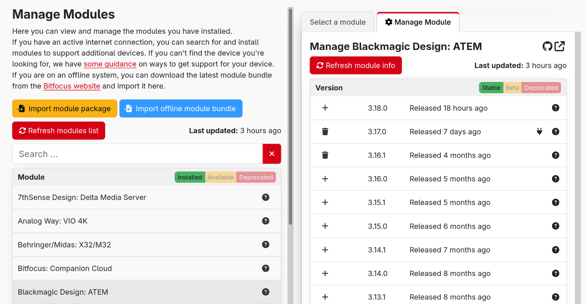

#### Modules as plugins

Previously, all modules were bundled with Companion and could only be updated when Companion itself was updated. Now modules are distributed as separate plugins that can be installed and updated independently.

You can install modules in two ways:

- **From the built-in store**: Browse and install modules directly within Companion's interface
- **Offline installation**: Import module bundle files for environments without internet access

This change means you'll get module updates faster and can choose which modules to install based on your specific needs.

_The new module management interface allows you to browse, install, and update modules independently from Companion_

#### XKeys button layout simplification

Since Companion 3.2, it has been possible to change the size of pages and to use a more intuitive mapping between physical button layout and Companion's button grid for xkeys surfaces. This new layout was the default for new installations of Companion.  
Prior to this, the mapping of xkeys buttons had to be compressed to translate to the 32 button pages.

Starting with Companion 4.0, support for the old layouts is removed. If you are still using these layouts you will need to update your buttons to match the new layout.

#### And more

- Modules are now installable plugins, allowing them to be updated independently
- Add `Logic: if statement` action
- Improved `internal: abort` actions, to give more granular control of what to abort
- Restructure app navigation
- Refinement of getting-started guide, to better handle scrolling
- Remove support for legacy xkeys layouts
- Allow custom variables descriptions to be edited
- Allow editing custom variable value as object
- Indicate type of each variable
- Handle body data in HTTP api setting custom variable
- Support for Mirabox Stream Dock 293V3 and N4
- Reimplement support for Contour Shuttle
- Support Resolve Replay Editor
- Support latest streamdeck models & network dock
- Allow remote surfaces to be disabled
- Allow specifying id of new emulators and surface groups
- Support granular permissions for modules (internal functionality, not exposed in the ui)
- Extend satellite api, to allow clients to handle display of locked state

##### 🐞 BUG FIXES

- Limit ui session lockout duration, to avoid browser crash
- Support HTTP_PROXY environment variables for module store api calls
- Emulator button presses on ios double triggering
- Adjust text vertical alignment on buttons
