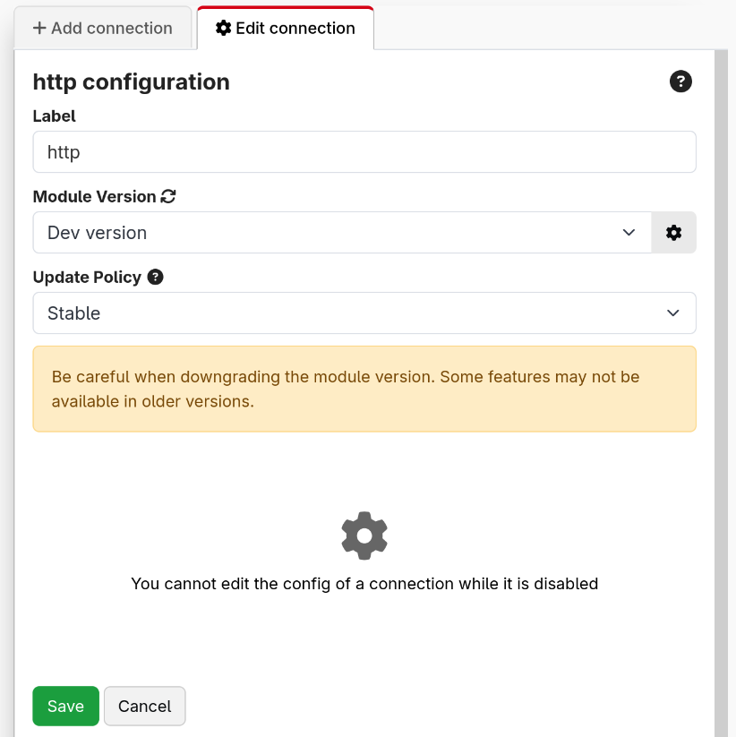

From the Connections tab, you can add, configure and remove devices. You can also see the status of a connection, as well as other information about it in the table.

In 4.0, the modules have been moved to be downloadable plugins. This allows you to get updates to modules much quicker and easier than before. As part of this, we do not distribute modules anymore with Companion.

:::note
When updating Companion, your modules are no longer automatically updated for you. You will need to manually update them when on this page when you are ready.

Similarly, when importing a config, you should make sure appropriate versions of the module are selected and are installed using this page.
:::

If you are on an offline system, the list of the right will likely be empty and you will need to download and import the offline module bundle from the website. You can read more about this in the [Modules section](#6_modules.md)

## Adding a connection

If you have not already installed a version of the module you need, you may need to toggle the list to show those which are available, not just those which are installed.

1.  Add a new device, by scrolling through the list or through a search.
2.  Choose the specific device you want to add.
3.  Fill out the dialog to choose the version of the module to use. In this, you can always choose any installed versions, and if you are able to access the store it will offer to install the latest version.  
    
4.  Enter the connection information for device. Save the changes.

Your new device should now show in the Connections tab along with all the other devices you want to control.
Each device needs to be a separate connection. If you have two separate Barco E2, you need to add both of them as separate connections.

:::note
If you have multiple connections using the same module, they can now each be running different versions of the module.
:::

Once you have added your connections, you can reorder or filter them in the table. In the rightmost column, you can expand a list of buttons:

- **Help** will open that module's help information. This is also possible in the list on the right before adding a connection.
- **Known Issues** will take you to the GitHub page for the module. You should report any bugs you encounter with the module here, or any feature requests for missing functionality. Tip: The more detail you give on a bug or feature request, the more likely it is to be handled quickly.
- **Variables** will show a list of all the variables that a connection provides. These can be used in various places either explained later on.
- **View Logs** is a debug log for the module. When reporting a bug, module developers may want extra information from here to help figure out the bug. To most users this will not be interesting.

A full list of supported devices can also be found on the website. [Companion Module Support List](https://bitfocus.io/connections)

## Configuring a connection

Once you have added a connection, you can click on it in the connection list to open its configuration in the right panel.

When the connection is disabled, you will be able to configure the version of the module, and some other basic properties.

In case you need it, you are able to force a connection to use a different module. This should not be needed for normal use, it is an escape hatch for edge cases we haven't thought of.

When the connection is enabled, you will be able to configure the module defined configuration.

