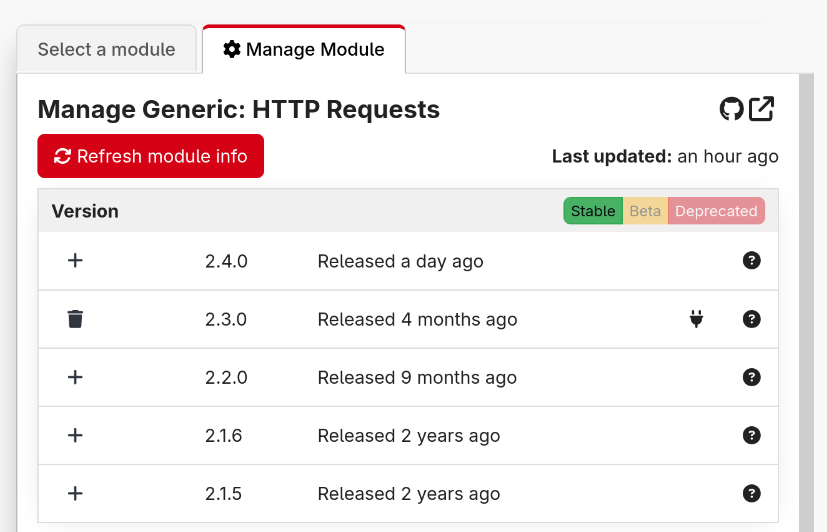

In this panel, you can manage the installed versions of a module.

By default the table shows all known stable versions, and indicates which are installed or not. For installed ones, the plug icon indicates that this version is in use by a connection.  
In the top right you can toggle showing beta versions of the module, as well as deprecated versions.

The 'refresh' button will refresh the module info from the store, in case there is a new version you wish to install. This gets performed on an interval too, so that we can indicate when new versions are available.

