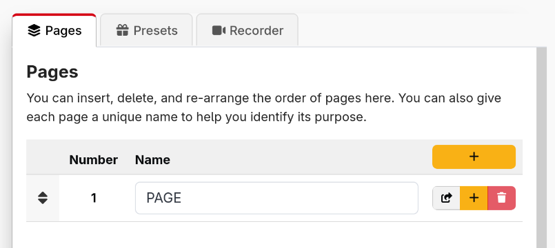

Since Companion v3.5, it has been possible to have as many or few pages in Companion as you would like.

For new installations, Companion starts off with 1 page, but you can add as many as many as you need, some users have hundreds others only a handful.

:::tip
It is a good idea to name each of your pages, to help you identify them easily
:::

:::danger
Be careful when reordering pages or inserting pages into the middle. Any references to page numbers will not be automatically updated, so you can break your existing buttons.
:::
