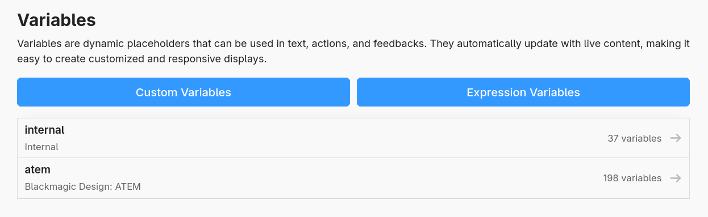
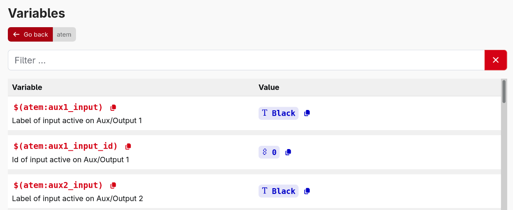
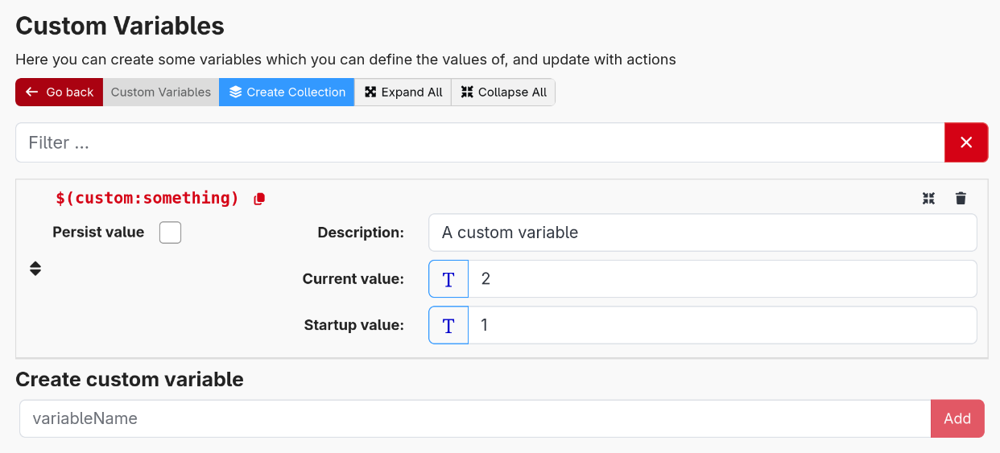
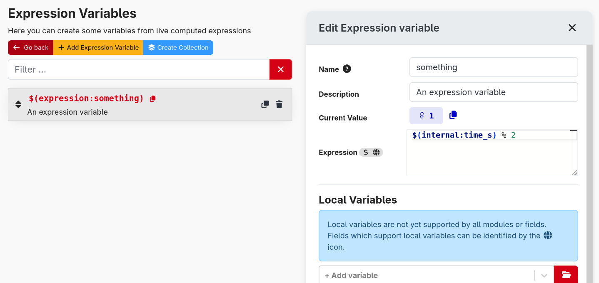
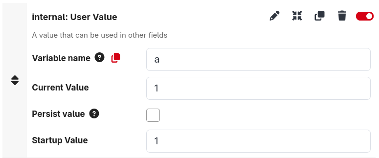
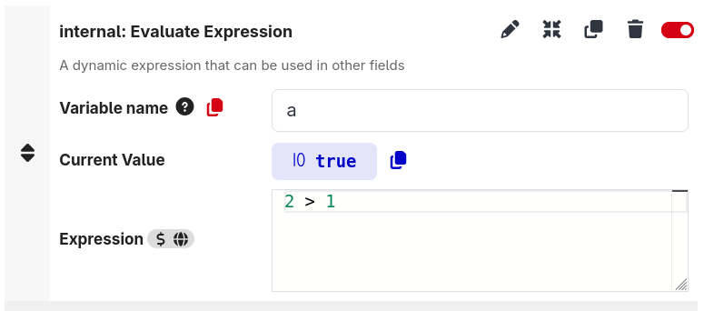
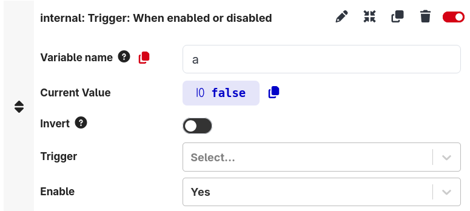

Variables allow you to use dynamic values inside of action options, feedback options, button styles and more.

You can view most of the variables under the variables page, they are split by their type and you can update their values here

:::tip
You can use variables in any input field with the variables support icon. Any other input field is unlikely to support variables

:::

For example, using one in button text:

There are a few types of variables:

## Connection Variables

These are read-only variables and are produced by the connections you have setup. Not all connections produce variables, any that do will be shown here.

:::note
There is also a section of variables here called 'internal'. These are similar to connection variables but are produced by Companion itself for your use
:::

## Custom Variables

These are variables defined by you, the user. These can contain any value you wish, and there are some internal actions to modify them.

You can use these for all kinds of things:

- Complex programming, to track state
- Aliases for values you may want to change, to save having to update 100s of usages when you do.
- A lot more

For each custom variable, you can see and set:

- **Current value** The current value of the variable
- **Startup value** The value to use for the variable upon restarting Companion
- **Persist value** Whether to persist the current value to be used upon startup. This will increase disk IO.

Just like connection variables a custom variable can hold data in different formats, called types.  
The available types are:

- string: a UTF-8 encoded text, e.g. `Hello "world" 😀`
- number: a IEEE754 floating-point number e.g. `2.4`, `-8`. Internally 64bits are used to store the number. That means that there is a limit in size and precision. When used as integer the range is -2^53 + 1 to 2^53 - 1
- boolean: the smallest digital information, `true` or `false`
- object: a collection of objects or other data types. Basically there are two forms, a keyed collection, often referred as a JSON (JavaScript object notation), and a indexed collection, called an Array.  
  JSON is enclosed in curly brackets and holds a comma delimited list of properties with a key name and a value, e.g. `{"key1":"value1", "key2":42, "third_key":{"description":"objects can be nested"}}`  
  Arrays are enclosed in square brackets and hold a comma delimited list of values without keys, the values are referenced by their position with the first position having the index 0, e.g. `["value1", 42, {"description":"arrays can hold different data types"}]`
- null: this is a special value that can't be called a string or a number or something else, so it has its own data type. The value and data type is called `null`. It is often used to express invalidity.

You can enter a value or startup value in two different ways: Text and JSON.
When the button on the left of a text entry field shows a T, you can enter text in the field and the variable will be updated with that text. The data type of the variable will be string.  
When the button on the left is switched to {}, you can enter JSON and the variable will be updated with the corresponding value. If you want to enter a number, just type it in JSON entry. If you want to enter a boolean just type true or false in JSON entry. If you want to enter a text in JSON entry you would need to enclose it in double quotation marks and escape all quotation marks inside the text, so it is easier to enter text with text entry.

Objects are very useful when you want to store multiple values in _one_ variable. Let's assume you want to store the names of 3 persons. You could add three custom variables with the names `name1`, `name2` and `name3`. But you can also create one custom variable for it with the name `names` and set it to the array `["Peter","Paul","Mary"]`. When you want to show a name on a button, you have to access it with an expression. E.g. the expression for getting the second name (index 1) is `$(custom:names)[1]`. If you want to change a single name in that array from an action, you have to use an expression to. Set for example the variable using the expression `arr=$(custom:names); arr[1] = 'John'; arr`. This expression will read the current array, set the second element to John and finally return the new array. This may sound more complicated than just updating a dedicated variable for name2, but now think of having to do this for 100 names.

:::note
For backwards compatibility, all custom variables will also parse under the legacy `$(internal:custom_counter)` scheme. This usage is deprecated and expected to be removed in a future Companion release.
:::

## Expression Variables

These are variables defined by you, the user. These are similar to Custom Variables, but instead of defining a value you define an expression to execute to calculate a value.

The value of these will be recalculated automatically, allowing you to build complex formula or help configure reactivity.

Shown here, is a simple example expression that will update each second and alternate between 0 and 1.

:::tip
Check the documentation on [expressions](../4_expressions/index.md) for more help
:::

## Local Variables

Since Companion 4.1, there has been limited support for Local Variables. These are variables local to a button, trigger or expression variable.

The value of them cannot be accessed from outside of their parent. They can be accessed in any supported field with the `$(local:` naming scheme. Support for using these is indicated by the globe icon.

Local variables can take their values from many ways:

|                                                                                                                 |                                                               |
| --------------------------------------------------------------------------------------------------------------- | ------------------------------------------------------------- |
| **User Value** These behave just like Custom Variables                                                      |       |
| **Evaluate Expression** These behave just like Expression Variables                                         |  |
| **Feedback** You can use most feedbacks from your connections. This allows you to use them in boolean logic |      |

Be careful to avoid creating cyclical loops between local variables, Companion will attempt to limit how often they update but it will consume excess CPU.

:::tip
The value of these variables cannot be read from outside of their parent, but for any 'User Value' variables it can be updated from elsewhere
:::

Additionally, in some places there are some builtin local variables under the `$(this:` name. Some of these are

- Page number of the button
  - Variable: `this:page`
- Column number of the button
  - Variable: `this:column`
- Row number of the button
  - Variable: `this:row`
- The current step of this button
  - Variable: `this:step`
- Page name of the current page
  - Variable: `this:page_name`
- The id of the surface triggering this action
  - Variable: `this:surface_id`
