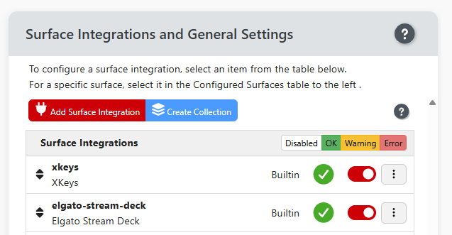

Companion supports a variety of physical and virtual input devices (surfaces) in addition to remote-control protocols. Surfaces provide buttons, encoders, displays, and other controls that you can map to actions in Companion.

Each surface may have unique capabilities and limitations. See the individual surface pages for model-specific details, configuration tips, and known limitations.

## Surface Modules / Integrations

Since Companion 4.3, surface support is delivered through a [module system](../3_config/modules.md) — the same approach used for [connections](../3_config/connections.md). This means that as new surface models are released, or bugs are fixed in existing ones, you can update just the relevant surface module without updating all of Companion.

Surface integration module settings are accessible from the right-hand panel of the [Surface Page](../3_config/surfaces.md). (If your browser window only shows a single panel, click the blue Show Settings button to get to the settings panel.)

In the right panel, click the red Add Surface Integration button.

From there, [Installing](../3_config/connections#adding-a-connection), [configuring](../3_config/connections#configuring-a-connection), and [updating](../3_config/connections#updating-a-connection) a surface module follows the same workflow as for Connections.

The module list and offline import can be managed from the [Modules page](../3_config/modules.md).

A full list of available surface modules and supported device models is on the [Bitfocus Developer site](https://developer.bitfocus.io/modules/companion-surface/discover).

## General Surface Settings

Global surface settings are also accessible from the right-hand panel of the [Surface Page](../3_config/surfaces.md). (If your browser window only shows a single panel, click the blue Show Settings button to get to the settings panel.)

For additional help, see the [surface settings](../3_config/settings.md#surfaces) help page or the [surface configuration](../3_config/surfaces.md) help page.
