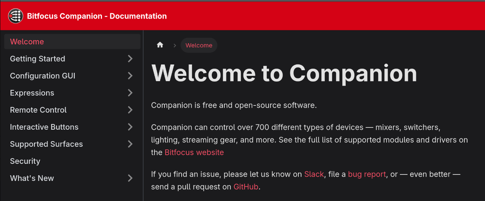
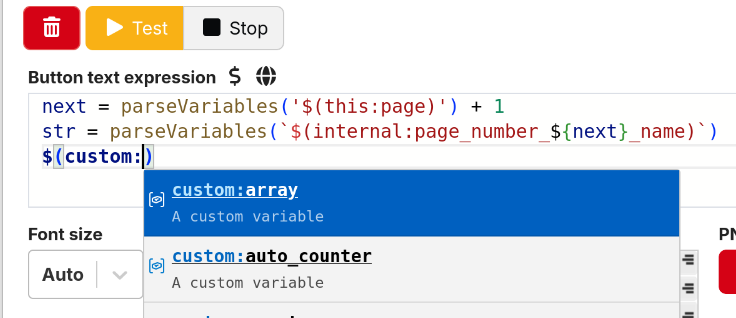

This is a slightly smaller release than usual, focussing more on smaller improvements.

## End of support for macOS 11

This version of Companion requires macOS 12 or later

## Rebuilt Documentation

The Companion User Guide has been rewritten to use a new rendering system.

This allows us to host a new publicly available version of the documentation [online](https://companion.free/user-guide/v4.2/) which is versioned per release, as well as building it in a simplified form within Companion

The new tools allow us to do more with the documentation and will make it easier for us to keep up to date too!

## Improved Expression Editor

The expression editor input field has been rebuilt, making it easier to use with functionality you would expect from a code editor. This includes functions and keyword suggestions, and better handling of multi-line expressions.

## And more

- The old xkeys $(internal:tbar) and similar variables have been removed, and they should now be bound to custom variables in the config of each surface (#3716)
- Require macos 12
- Convert docs to docusaurus (#3741)
- Rebuild emulator pincode locking
- Add options to to restrict page access (#3736)
- Enhanced expressions:
  - Improved expression editor (#3713)
  - More formatting for timestamp (#3668)
  - Handle negative value in msToTimestamp (#3651)
  - Support local variables in step expressions #3762
  - Expressions better handle undefined. add `getVariable` method #3451 (#3715)
- Refined connection management:
  - Reworked connection config layout #3559 (#3569)
  - Rework changing connection versions, to remove need to disable module first
  - Add delete button to connection edit panel
  - Allow changing connection enabled state from config panel
  - Indicate connections missing modules in sidebar
- Surface improvements:
  - Merge surface remote and discover pages (#3677)
  - Support resolve speed editor #3525
  - Support more variants of Mirabox 293S
  - Support for Mirabox Streamdock N3 (#3686)
  - Add repeating button-presses to contour-shuttle shuttle ring (#3492)
  - Improve vec-footpedal surface implementation
  - Support complex surface layouts over satellite api (#3611)
  - Support swipe to change page on Stream Deck + (#3721)
  - Support touch strip variables for Loupedeck Live (#3790)
- Draw button 'error' state as a red warning triangle (#3675)
- Remove deprecated bank field from tcp bank_bg_change message #2779
- Include timestamps and source in module debug logs
- Add version number variables #3714
- Rework update check api, improving reliability

### 🐞 BUG FIXES

- ember+ api issues with some clients
- limit env vars passed to modules
- improve error handling for module executeAction
- "Sentry DSN not located" error in launcher (#3758)
- Align the display name of `surface_set_position` with the UI terminology (#3761)
- Avoid flooding modules with large objects, batch entity updates to resolve issues with large configs
- preserve original types of custom variable values from osc and ember+ apis
- improve version number handling for release vs beta builds
- Page up button/Page down button don't set page-history (#3683)
- Reduce frequency of pincode lock state logging (#3792)
- Loupedeck Live pincode lock layout
