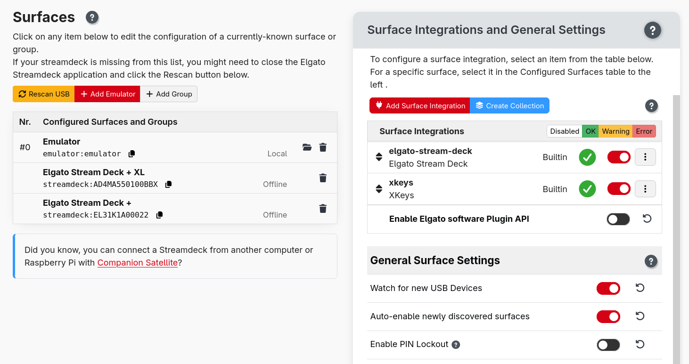
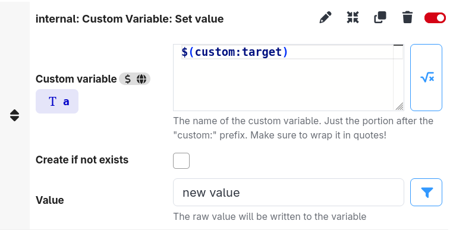

## Surface Module System

The biggest change in 4.3 is that surface support is now delivered through a downloadable module system — the same approach already used for connections.

Previously, support for every surface was baked into Companion itself, meaning you needed a full Companion update to get support for a new Stream Deck model or a surface bug fix.

This means:

- New Stream Deck models (and other surfaces) can be supported by updating just the surface module, without waiting for a Companion release.
- Each surface module can be updated independently, so a fix for one device doesn't require touching anything else.
- The same module management UI used for connections applies to surfaces. See [Modules](../3_config/modules.md) for details.

We hope this will encourage others to add support for new types of surfaces. The development experience is similar to that of connection modules.

## Enable and Disable Individual Surfaces

Surfaces can now be individually enabled or disabled from the Surfaces page. Disabling a surface stops Companion from claiming it, but preserves its configuration for when you want to re-enable it.

This is useful when running Companion alongside other software (such as the Elgato Stream Deck app) — you can pick which devices each application manages.

## Expressions in Any Action or Feedback Field

The connection module API has had a major revision in this release. The main change is to make it possible for **any** action or feedback input field to support expressions. Where supported, a toggle button next to the input field lets you switch it into expression mode.

Unfortunately, this requires modules to update to the latest versio of the module-api making this opt in. We hope to see many modules start to support this in the coming months — it greatly increases the flexibility of Companion.

## Modernising the Elgato Plugin

The Elgato Stream Deck plugin has been updated to support connecting over the **Satellite API** making it the preferred way for the plugin to connect to Companion.

Previously, the plugin communicated with Companion using an older, Elgato plugin-specific protocol. The Satellite API is a more modern, general-purpose alternative that is already used by the Satellite application and other third party software and hardware. Using it for the plugin means consistent behaviour across all surface types and a simpler integration overall.

If you are currently using the Elgato plugin, you can continue using it as before; however, we intend to remove support for the old protocol in a couple of Companion releases' time. When setting up a new connection, the plugin will now guide you toward using the Satellite API instead.

The plugin has also received a number of UI bug fixes.

## And more

- Surfaces are now implemented through a module system, similar to connections.
- Option to enable/disable individual surfaces
  - This allows Companion to run alongside other software with each using just some of the connected stream decks
- Support expressions in any action/feedback field
  - This requires modules to opt into supporting it for now
- Get custom-variable via tcp #3999
- preview local variable value next to editor
- Ability to execute trigger at random intervals
- Improving expressions
  - add URI encode/decode functions #3771
  - Add `blink()` function to expressions. This can be used in feedbacks to provide customisable blinking behaviour
  - Extended time formatting options
  - Date expression functions (#4021)
- Rework various panels/lists to group connections by collections instead of as a flat list
- Improve performance of some button drawing #3902 #3891
- Various styling refinement
  - Rework button grid presentation
  - Add help icon to header bar
  - improve drag and drop previews
  - Update app icon on macos
  - add collapse/expand all buttons for collection items (#4063)
  - add or update help and close icons in panel headers (#4053)
- Add support for `SENTRY_DISABLE` environment variable, to disable sentry reporting
- Option to suppress header notifications (#4004)
- Add docker COMPANION_ADMIN_PORT environment variable for admin port configuration (#4042)
- Expand satellite api to cover full module and elgato plugin functionality
- Add HTTP API endpoints for connection management (#4048)

### 🐞 BUG FIXES

- Improve presentation of missing values in dropdowns
- navigation to anchor link in /user-guide (#4036)
- Local variable updates do not immediately apply #3953
- show modules which only have prerelease version in the add list
- upgrade scripts isInverted failing
- certain triggers not being disabled with the collection (#3981)
- respect multiline for connection config fields #3986
- connection collections being lost during full import
- udp service not listening when ipv6 enabled
- preserve type of expressions when writing to custom/local variables #3954
- child entities not being upgraded #3924
- improve confusing trigger terminology "depress" (#3922)
- ensure module manifest doesn't load root file from outside of package
- Launch main companion process with the `--use-system-ca` flag (#4060)
