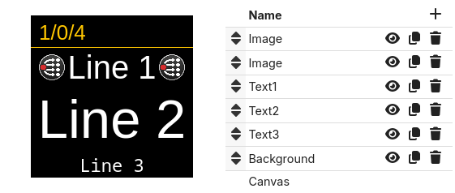
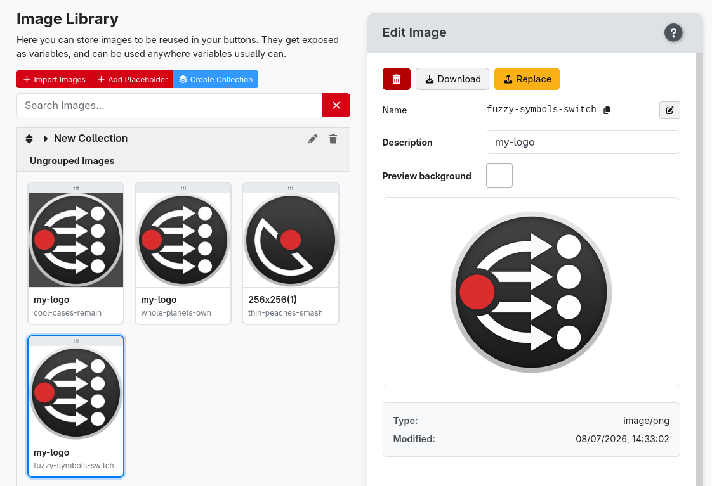
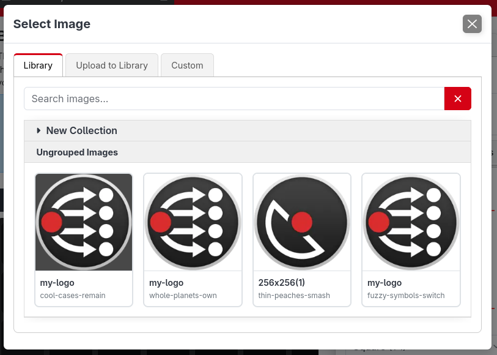
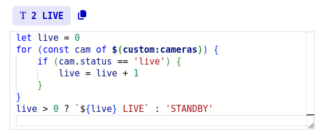
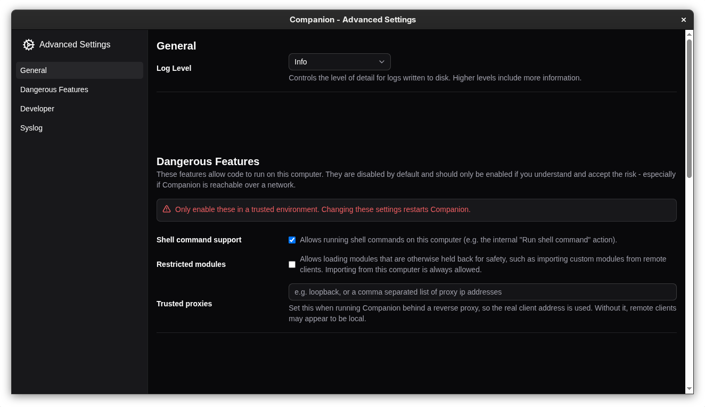

Companion 5.0 is a major release. The headline is a complete overhaul of how buttons are drawn, but it also brings more powerful expressions and a new image library.

## Supported platforms update

Before you upgrade, note that 5.0 changes which platforms Companion runs on:

- **macOS 13.5 or later** is now the minimum supported version.
- **Windows on ARM64** is now supported with a native build. (#2933, #4270)
- **Linux** gets a packaged install script and desktop udev syncing for smoother device permissions. (#4248)
- **Raspberry Pi** users have a new Companion configuration tool. (#4256)

## Graphics Overhaul

The biggest change in 5.0 is a complete rebuild of how buttons are drawn. Instead of a single fixed style, each button is now built up from a fully customisable **stack of elements** — text, images, gauges and shapes — that you can add, reorder, duplicate and combine however you like.

This opens up a huge amount of creative freedom. A button can now layer an image behind two independently sized pieces of text, or show a live **gauge** element that moves with a variable value. A new **reference** element lets one button reuse the drawing of another. Text now has two separate font-size properties for finer control, and drawing is no longer locked to a square — Companion can render the correct non-square shape on Stream Deck models that need it.

Behind the scenes, buttons on inactive pages are now **lazily rendered**, so large configurations spread across many pages use less CPU when those pages aren't being shown.

## Image Library

Images are now first-class assets. The new **Image Library** gives you one place to upload, organise into collections, and reuse images across as many buttons and elements as you like, instead of attaching a separate copy to each button.

When you add an image element, you pick from the library rather than uploading again, so updating an image in one place updates it everywhere it's used. You can also set a custom preview background color to check how an image looks against different button styles.

Using the Image Library is optional, images can still be uploaded directly to individual buttons.

## Advanced expressions

Expressions have gotten even more advanced. In addition to the existing functions, they gain proper **control flow** — `if`/`else`, loops, statements and functions — along with a range of other new utilities.

This means you can do so much more inside expressions without needing to resort to triggers or shell scripts.

To ensure performance isn't impacted, there is a number of executed operations limit imposed on all expressions. This means any accidental infinite loops will get aborted after a few ms instead of crashing Companion.

## The road to a more secure Companion

Companion frequently has access to a lot: the equipment it controls, the software it integrates with, and the network it sits on. At the same time the wider threat landscape keeps getting more hostile, with automated and AI-driven attacks now routine. So 5.0 begins a deliberate effort to improve its security story.

- **Secure by default.** Running shell commands and installing modules over the network from another machine are now switched **off by default**. If you need them, they can be re-enabled from the launcher. Installing modules from the store or when configuring from the local machine is unaffected.
- **Hardening under the hood.** This release adds protection against cross-site attacks (a web page you have open trying to talk to Companion) and against denial-of-service attempts using oversized or malformed data.

These are first steps rather than a finished job — Companion is not "secure by design" overnight, and there is more to come — but they meaningfully raise the baseline for everyone.

## Elgato plugin server removed

The dedicated server that the Elgato Stream Deck software plugin used to connect to Companion has been removed (#4123). The plugin now connects over the Satellite API, the same general-purpose protocol used by the Satellite app and other integrations.

If you use the Elgato Stream Deck plugin, make sure it is up to date and configured to connect over the Satellite API.

## And more

- Variables
  - Access a local variable from another button #3723 (#4234)
  - Support feedback based local variables from presets #3893
  - Allow actions that return a result, to permit storing that result in a local or custom variable #4065
  - Fuzzy search in variables table
- Surfaces
  - Action to adjust surface brightness (#4273)
  - Variable for surface brightness (#4266)
  - Add action and feedback to enable/monitor active remote surfaces #4194 (#4206)
  - Page number button takes surfaces to their startup page
  - mdns announce satellite ports (#4288)
  - Add support for sending compressed images over satellite
  - Rework confusing 'never lock' property (#4290)
- Editor and UI improvements
  - Better indicator of regex invalid/valid (#4271)
  - Add notes to control editors #760 (#4202)
  - Context menu for grid buttons (#4203)
  - One click convert page buttons to be editable (#4208)
  - Indicate disabled actions/feedbacks/events/triggers etc better #4030
  - Option to hide the status icons #3805 (#4143)
  - Improved drag and drop support for touchscreen
- Platform and system
  - Configurable timezone (#4285)
  - Show path to configuration folder on log screen #4236
  - Include date and source in connection debug log csv

### 🐞 BUG FIXES

- add receive buffer cap for satellite and tcp listener
- add gunzip limits
- protect against dns-rebind
- stricter origin validation
- sanitise rosstalk messages
- auto-add windows firewall rules
- add resume/online watchdog to recover dead ws connections
- don't permanently close ws client when entering Safari bfcache
- add connect timeout to webui WebSocket to unwedge Safari reconnects
- make local variables editor handle non-string values #3166
- avoid duplicate value preview in expression variable editor
- rate limit triggers when responding to rapid variable changes #3312
- remember active button edit tab
- tab scrollbar not always showing in safari #4103
- allow data images in markdown #3408
- add deprecation marker to old 'Button: set X' actions
- clarify deprecation of 'use another buttons style'
- show better failure when encountering invalid image
- implement custom monaco drag handle for safari #4265
- rate limit variables updates from modules to be at most 50hz #3859
- running packaged module from dev modules folder #3930
- page numbers not invalidating on page move
